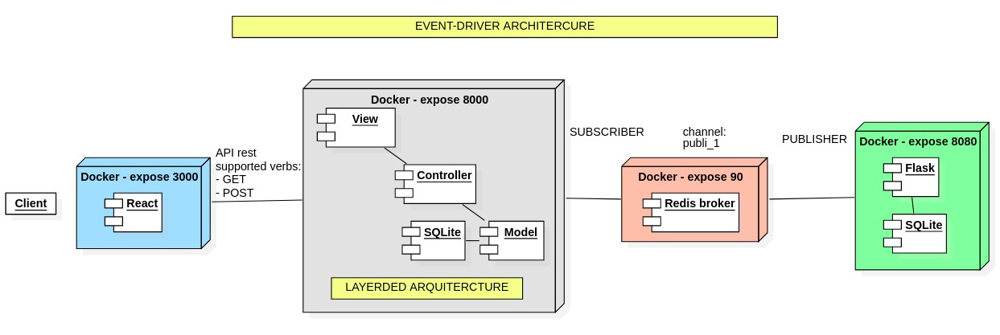

# - `Proyecto`
Arquitectura event-driver con Redis.

# - `Deploy`
- descargar repositorio
- ejecutar el siguiente comando
```bash
cd (path of repository)
docker-compose up -d
```
- ejecutar:
```bash
python3 algo/publish.py
```
- Ir a la [siguiente](http://127.0.0.1:8000/app/pu) direccion y ver la respuesta que recibimos desde la cola de redis. Notar que los datos una vez recibidos ya no podran verse nuevamente.

# - `contenedores...`
## -- create imagen
```bash
cd (path of repository)
docker build -t python-image .
```
## -- create container and enable port ([Informacion oficial](https://docs.docker.com/engine/reference/commandline/run/#full-container-capabilities---privileged))
```bash
docker run -t -i --privileged --name python-container -p 8000:8000 python-image
```
## -- create container and show console
If you want to go to the console inmediately after the container was created use
this command. This is usefull when you container doesn't initialize.
```bash
docker run -t -i --privileged --name python-container python-image bash
```
## -- if container starts correctly and you want to use the bash anyway
```bash
docker exec -it python-container bash
```
## -- comments
- requirements not installed in venv. We have to correct it.

# - `Problemas con algun contenedor`
Si se quiere testear un contenedor se puede hacer lo siguiente. Crear un archivo y hacer que se ejecute recurrentemente para mantener el servidor vivo:

En caso se requiera mantener el servidor vivo pero no se quiera usar alguno de estos comandos (los cuales se encuentran dentro de los archivos _Dockerfile_):

```docker
...
CMD [ "python3", "manage.py", "runserver", "0.0.0.0:8000" ]
```
```docker
...
CMD ["npm", "start"]
```
```docker
...
CMD ["waitress-serve", "--call", "flaskr:create_app"]
```

se debe crear un archivo que trabaje en bucle y no termine. Luego ejecutar este archivo en ver del comando mencionado segun corresponda:
```docker
#CMD [ "python3", "manage.py", "runserver", "0.0.0.0:8000" ]
CMD ["python3", "mantener_servidor.py"]
```
# - `doc`
- https://redis.io/
- https://pypi.org/project/redis/
- https://www.djangoproject.com/
- https://docs.djangoproject.com/en/4.1/topics/cache/#redis
- https://flask.palletsprojects.com/en/2.2.x/
- https://hub.docker.com/_/python

